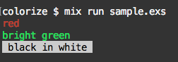

# Colorize

see https://en.wikipedia.org/wiki/ANSI_escape_code#Colors

## Installation

```elixir
def deps do
  [
    {:colorize, github: "mattsan/colorize_ex"}
  ]
end
```

## Usage

```elixir
iex> import Colorize
iex> ~l"red"r
"\e[31mred\e[m"
iex> ~l"bright green"G
"\e[92mbright green\e[m"
iex> ~l" black in white "kw
"\e[30;47m black in white \e[m"
```

### sample.exs

```elixir
import Colorize

IO.puts(~l"red"r)
IO.puts(~l"bright green"G)
IO.puts(~l" black in white "kw)
```

```
$ mix run sample.exs
red
bright green
 black in white
```


